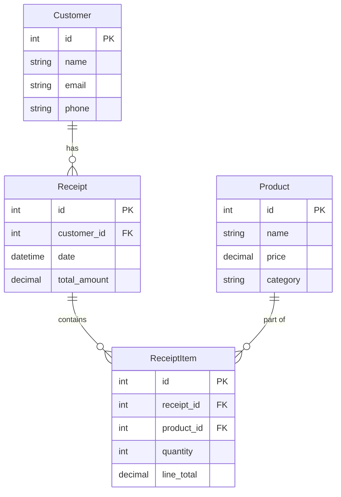

# Python and SQL Reflections

This is truly a self-assessment, as you will need to reflect on what you learned in this project and collect your thoughts on the following questions. Part of becoming a high-value software developer is understanding key concepts... not just the ability pattern match and write code.

When you are done reflecting on these topics and feel that you have a solid understanding of each one, reach out to an instructor for a vocabulary review to ensure you are prepared for technical interviews.

## What You Should Know

We will not be discussing these questions during the interview, because we expect you to have this knowledge. It is your job to ensure that you have the understanding and vocabulary for them.

### `if` Statements

1. Do I understand how to use `elif` and `else` in conjunction with `if`?
    > We use `elif` to check multiple conditions in sequence, and `else` to provide a default action if none of the previous conditions are met.
2. What is the difference between using `==` and `is` / `is not` with an `if` statement?
    > `==` checks for value equality, while `is` checks for identity, meaning whether two references point to the same object in memory. Examples:

    ```python
    a = [1, 2, 3]
    b = a
    c = [1, 2, 3]

    print(a == c)  # True, because values are equal
    print(a is b)  # True, because both refer to the same object
    print(a is c)  # False, because they are different objects in memory
    ```

3. How would I check to see if a dictionary had a key with an `if` statement?
    > You can use the `in` keyword to check if a key exists in a dictionary. For example:

    ```python
    my_dict = {"name": "Alice", "age": 30}
    if "name" in my_dict:
        print("Key 'name' exists in the dictionary.")
    ```

### `for` Loops

1. Write a `for` loop to iterate over elements in a list or tuple?
    > Here is an example of a `for` loop iterating over a list:

    ```python
    my_list = [1, 2, 3, 4, 5]
    for item in my_list:
        print(item)
    ```

    > And here is an example of a `for` loop iterating over a tuple:

    ```python
    my_tuple = (1, 2, 3, 4, 5)
    for item in my_tuple:
        print(item)
    ```

    > I could loop over the letters in a string as well:

    ```python
    my_string = "hello"
    for char in my_string:
        print(char)
    ```

2. How would I loop over the keys and values in a dictionary?
    > You can use the `items()` method to loop over keys and values in a dictionary. For example:

    ```python
    my_dict = {"name": "Alice", "age": 30}
    for key, value in my_dict.items():
        print(f"Key: {key}, Value: {value}")
    ```

### Functions

1. Write the code that defines and calls a simple function in Python?
    > Here is an example of defining and calling a simple function in Python:

    ```python
    def greet(name):
        return f"Hello, {name}!"

    # Calling the function
    message = greet("Alice")
    print(message)  # Output: Hello, Alice!
    ```

2. Explain the concepts of function arguments and return values?
    > Function arguments are the inputs that you pass to a function when you call it. They allow you to provide data that the function can use to perform its task. Return values are the outputs that a function produces after executing its code. They allow you to send data back to the caller. For example, in the `greet` function above, `name` is an argument, and the string returned by the function is the return value.
3. Describe the technical difference between a method and a function?
    > A function is a standalone block of code that can be called independently. A method is a function that belongs to a class or object and is called on an instance of that class (or the class itself).
4. What do I need to do to invoke a function that is defined in a different module?
    > To invoke a function defined in a different module, you need to import the module using the `import` statement or `from ... import ...` syntax. Then, you can call the function using the module name as a prefix (if using `import`) or directly (if using `from ... import ...`). For example:

    ```python
    # Assuming we have a module named my_module.py with a function greet
    import my_module

    my_module.greet("Alice")  # Calling the function using the module name

    # Or using from ... import ...
    from my_module import greet

    greet("Alice")  # Calling the function directly
    ```

## Concepts and Vocabulary We Will Discuss

These questions will be discussed during our interview, but we will not review the actual code.

### Classes

- What is the purpose of a class in object-oriented programming (OOP)?
    > Classes let you define properties and methods that each instance of that class object will inherit.
- How does defining a class differ from instantiating an object of that class?
    > When defining a class, it will use the `class` syntax followed by the class name and a colon. Instantiating an object of that class involves calling the class as if it were a function, optionally passing arguments to the class's `__init__` method. Here are some examples:

    ```python
    # Defining a class
    class Dog:
        def __init__(self, name):
            self.name = name
        def bark(self):
            return "Woof!"
    # Instantiating an object of the class
    my_dog = Dog("Fido")
    print(my_dog.bark())  # Output: Woof!
    ```

### Modules

1. Can I explain what a Python module is and why it is useful?
    > A Python module is a file (like `my_file.py`) with Python code (functions, classes, variables, etc.) that can be imported and reused in other programs. Modules are useful for organizing related code together, promoting code reuse, avoiding duplication, and keeping repositorys clean by grouping related functionality together.
2. Do I know how to import and use functions from a module?
    > We can import a module using the `import` statement or `from ... import ...` syntax. Once imported, we can call functions defined in that module using the module name as a prefix (if using `import`) or directly (if using `from ... import ...`). For example:

    ```python
    # Assuming we have a module named my_module.py with a function greet
    import my_module
    my_module.greet("Alice")  # Calling the function using the module name
    # Or using from ... import ...
    from my_module import greet
    greet("Alice")  # Calling the function directly
    ```

3. What are the benefits of packages when developing Python projects?
    > Packages allow us to organize related modules into a directory structure, making it easier to manage and maintain larger codebases. They help avoid naming conflicts by providing a namespace for modules, promote code reuse, and improve code organization by grouping related functionality together.

### HTTP Response Codes

1. When a server throws an unexpected exception, which status code should I send to the client in the response?
    > The status code 500 (Internal Server Error) should be sent to the client when the server encounters an unexpected exception. Unexpected exceptions indicate that something went wrong on the server side that was not anticipated or handled by the application code (ie client sent bad code).
2. If the client requested a supported resource that doesn't exist, what status code should be part of the response meta-data?
    > The status code 404 (Not Found) should be part of the response meta-data when the client requests a supported resource that doesn't exist. Non-existent resource examples include requesting a user profile with an ID that is not in the database.
3. If the client did not send all of the required data in the payload of the request, what status code should be part of the response meta-data?
    > The status code 400 (Bad Request) should be part of the response meta-data when the client does not send all of the required data in the payload of the request. This could be missing fields, incorrect data types, or invalid values when sending data to the server.
4. If the client tries to perform an action _(GET, POST, PUT, or DELETE)_ that isn't supported by the API, what status code should be part of the response meta-data?
    > The status code 405 (Method Not Allowed) should be part of the response meta-data when the client tries to perform an unsupported action. Examples include trying to DELETE a resource that only supports GET and POST methods.
5. If the client tries to access a resource that requires authentication without providing valid credentials, what status code should be part of the response meta-data?
    > The status code 401 (Unauthorized) should be part of the response meta-data when the client tries to access a resource that requires authentication without providing valid credentials. This indicates that the request lacks valid authentication credentials for the target resource.
6. If the client successfully performs an action that results in the creation of a new resource, what status code should be part of the response meta-data?
    > The status code 201 (Created) should be part of the response meta-data when the client successfully performs an action that results in the creation of a new resource. This indicates that the request has been fulfilled and has led to the creation of a new resource.

## Code Review

### Data Structures

1. Where do I create, modify, and access elements in a Python list?
    > You can create a list using square brackets `[]`, modify elements by accessing them via their index, and access elements using their index as well. For example:

    ```python
    # Creating a list
    my_list = [10, 20, 30, 40, 50]

    # Accessing an element (e.g., the first element)
    first_element = my_list[0]  # Output: 10

    # Modifying an element (e.g., changing the second element)
    my_list[1] = 25  # Now my_list is [10, 25, 30, 40, 50]
    ```

2. If I was asked in an interview to describe a dictionary, what would I say?
    > A dictionary in Python is an unordered collection of key-value pairs, where each key is unique and is used to access its corresponding value. Dictionaries are mutable, meaning you can change their contents by adding, modifying, or removing key-value pairs. They are defined using curly braces `{}` with keys and values separated by colons. For example:

    ```python
    my_dict = {
        "name": "Alice",
        "age": 30,
        "city": "New York"
    }
    ```

3. Explain how to access and modify values based on keys in a dictionary.
    > You can access values in a dictionary by using their corresponding keys inside square brackets or with the `get()` method. To modify values, you can assign a new value to a specific key. For example:

    ```python
    my_dict = {
        "name": "Alice",
        "age": 30,
        "city": "New York"
    }

    # Accessing a value using a key
    name = my_dict["name"]  # Output: "Alice"
    age = my_dict.get("age")  # Output: 30

    # Modifying a value using a key
    my_dict["age"] = 31  # Now age is updated to 31
    my_dict["city"] = "Los Angeles"  # Now city is updated to "Los Angeles"
    ```

4. Explain the difference between an object and a dictionary in Python.
    > An object in Python is an instance of a class that can have attributes (data) and methods (functions) associated with it. Objects encapsulate both data and behavior, allowing for more complex interactions and functionality. A dictionary, on the other hand, is a built-in data structure that stores key-value pairs without any associated behavior. While dictionaries are used for simple data storage and retrieval, objects can represent more complex entities with specific behaviors defined by their methods.
5. What can an object do that a dictionary can't?
    > An object can encapsulate both data and behavior through methods, allowing it to perform actions and maintain state. Objects can also support inheritance, polymorphism (the ability to present the same interface for differing underlying data types, such as animals all having methods like `speak()` that execute differently), and encapsulation (the bundling of data with the methods that operate on that data), which are key principles of object-oriented programming. In contrast, a dictionary is simply a collection of key-value pairs and does not have the ability to define behaviors or support these OOP concepts.

### Try/Except

1. Explain the purpose of a `try/except` block in Python?
    > the `try` block may contain code that could disrupt the normal flow of a program or make it crash and the `except` block handles any exceptions that might disrupt the program flow so that it can continue running.

### SQL

Review the following database diagram.



1. Explain what SQL is and why it is used in software development.
    > SQL (Structured Query Language) is a standardized programming language used to manage and manipulate relational databases. It is used in software development to perform various operations such as querying data, inserting new records, updating existing records, and deleting records from a database. SQL allows developers to interact with the database in a structured way, making it easier to retrieve and manage data efficiently.
2. Write a basic SQL query to select a single record from the **ReceiptItem** database table.
    > Here is a basic SQL query to select a single record from the **ReceiptItem** table:

    ```sql
    SELECT * FROM ReceiptItem WHERE id = 1;
    ```

    > This query retrieves all columns for the record in the **ReceiptItem** table where the `id` is equal to 1.
3. Construct a SQL query that returns all receipt items, but includes the product name and the receipt total amount?
    > Here is a SQL query that returns all receipt items along with the product name and the receipt total amount:

    ```sql
    SELECT 
        ri.*, 
        p.name AS product_name, 
        r.total_amount AS receipt_total
    FROM 
        ReceiptItem ri
    JOIN 
        Product p ON ri.product_id = p.id
    JOIN 
        Receipt r ON ri.receipt_id = r.id;
    ```

    > This query joins the **ReceiptItem**, **Product**, and **Receipt** tables to retrieve all receipt items along with the corresponding product names and receipt total amounts.
4. Demonstrate using the `WHERE` clause to filter records in a SQL query that returns all receipts with a total that is greater than 100.00.
    > Here is a SQL query that uses the `WHERE` clause to filter records and return all receipts with a total amount greater than 100.00:

    ```sql
    SELECT * FROM Receipt WHERE total_amount > 100.00;
    ```

    > This query retrieves all columns from the **Receipt** table where the `total_amount` is greater than 100.00.
5. Update your previous query to exclude receipts that were generated before 2024.
    > Here is the updated SQL query that excludes receipts generated before 2024:

    ```sql
    SELECT * FROM Receipt 
    WHERE total_amount > 100.00 
    AND date >= '2024-01-01';
    ```

    > This query retrieves all columns from the **Receipt** table where the `total_amount` is greater than 100.00 and the `date` is on or after January 1, 2024.
6. Explanation of these lines:

```sql
Customer ||--o{ Receipt : has
Receipt ||--o{ ReceiptItem : contains
Product ||--o{ ReceiptItem : "part of"
```

 > The lines in the diagram represent the relationships between the entities (tables) in the database. The notation `||--o{` indicates a one-to-many relationship. Specifically:
    - `Customer ||--o{ Receipt : has` means that one Customer can have many Receipts.
    - `Receipt ||--o{ ReceiptItem : contains` means that one Receipt can contain many ReceiptItems.
    - `Product ||--o{ ReceiptItem : "part of"` means that one Product can be part of many ReceiptItems.
